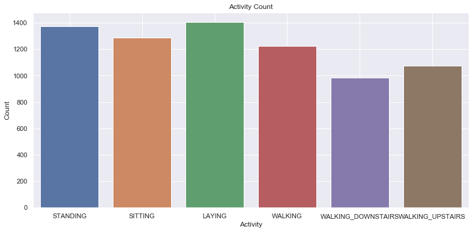
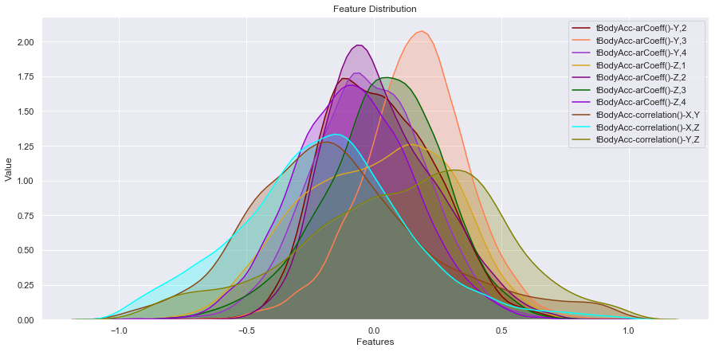
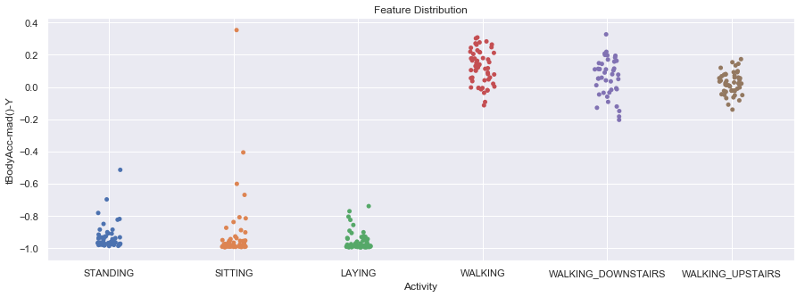
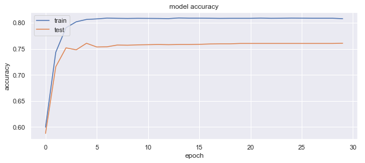
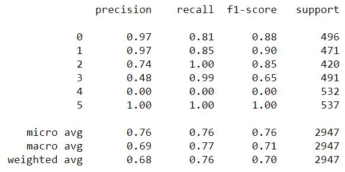
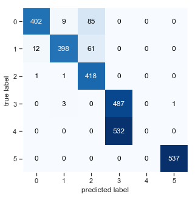

# ANN for Human Activity Recognition

Human Activity recognition using Artificial Neural Network

# Dataset

  - **[UCI HAR](https://archive.ics.uci.edu/ml/datasets/Human+Activity+Recognition+Using+Smartphones)**

# Tools

- **Jupyter Notebook**

# Description
- **UCI HAR** dataset activity types


- Feature Distribution for Accelerometer data


- **Feature Distribution** for different types of activities


# ANN Model
```sh
model = Sequential()
model.add(Dense(64, input_dim=X_train.shape[1] , activation='relu'))
model.add(Dense(64, activation='relu'))
model.add(BatchNormalization())
model.add(Dense(128, activation='relu'))
model.add(Dense(196, activation='relu'))
model.add(Dense(64, activation='relu'))
model.add(Dense(32, activation='relu'))
model.add(Dense(6, activation='sigmoid'))
model.compile(optimizer = Adam(lr = 0.0005),loss='categorical_crossentropy', metrics=['accuracy'])
print(model.summary())
```
### Model Accuracy (train vs test)


### Classification report


### Confusion Matrix



